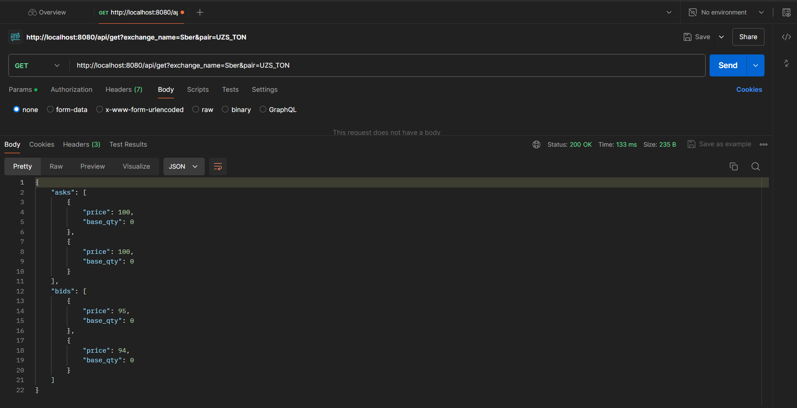
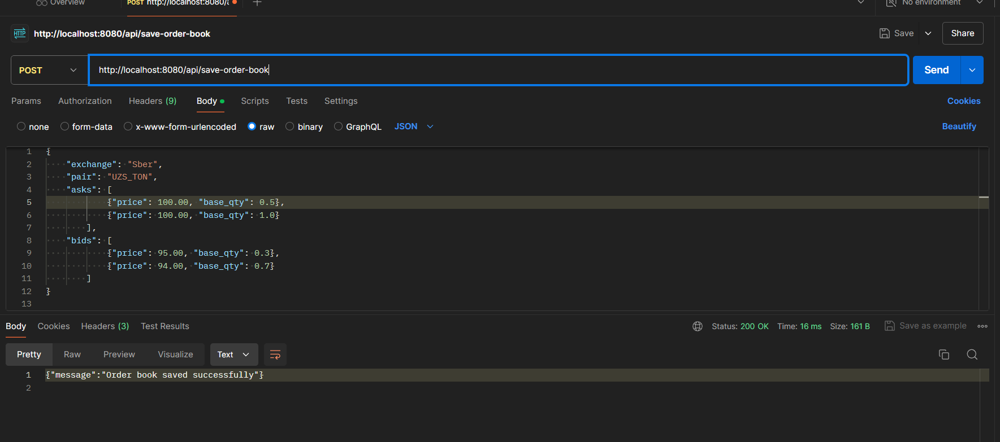
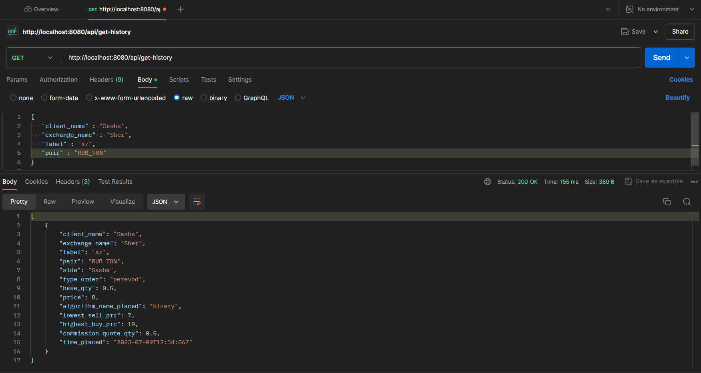
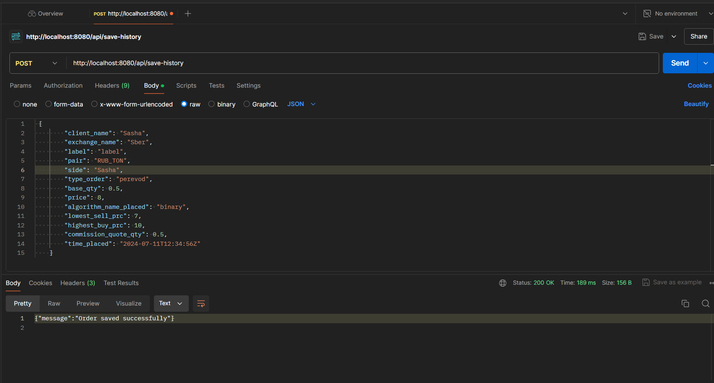

# Документация Сервиса Сбора Статистики
***
## Обзор
Сервис Сбора Статистики - это сервис на Go, который взаимодействует с PostgreSQL для управления книгами ордеров и историей ордеров. Эта документация предоставляет обзор сервиса, его API-эндпоинтов и как настроить и запустить его.
***
## Задача:
Требуется реализовать сервис, у которого 4 ручки:
- GetOrderBook(exchange_name, pair string) ([]*DepthOrder, error)
- SaveOrderBook(orderBook *OrderBook) error
- GetOrderHistory(client *Client)  ([]*HistoryOrder, error)
- SaveOrder(client *Client, order *HistoryOrder) error
***

### Используемые технологии:

- Go
- gorilla/mux framework
- pgxpool
- PostgreSQL
- Docker
***
## Содержание

1. [Конфигурация](#конфигурация)
2. [Запуск Сервиса](#запуск-сервиса)
3. [API Эндпоинты](#api-эндпоинты)
    - [Get Order Book](#get-order-book)
    - [Save Order Book](#save-order-book)
    - [Get Order History](#get-order-history)
    - [Save Order History](#save-order-history)

***
## Конфигурация

Конфигурация сервиса уже настроена в docker-compose в виде переменных окружения.
Подробно можно посмотреть и поменять в файле 
``` 
docker-compose.yml
```
 #### Пример:
```yaml
    environment:
      DB_USERNAME: "postgres"
      DB_PASSWORD: "statistics"
      DB_DB: "postgres"
      DB_HOST: "db"
      DB_TABLE: "postgres"
      DB_PORT: "5432"
      SSL_MODE: "disable"
    ports:
      - "8080:8080"
```

***
## Запуск сервиса

1. Клонируем репозиторий:
```
git clone https://github.com/instinctG/statistics-service.git
```

2. Билдим и поднимаем контейнеры в docker-compose (app + PostgreSQL containers)

### Команды
Сбилдить и поднять контейнеры
```sh
make up
```
- если с первого раза не получилось запустить сервер, можно повторно выполнить команду make up
***

Завершить работу сервиса 
```sh
make down или Ctrl+C
```

Ниже предоставлена информация по эндпоинтам, а также примеры взаимодействия с API.

***
## API Эндпоинты

Сервис предоставляет следующие API-эндпоинты:

### Get Order Book

- **Эндпоинт**: `/api/get-order-book`
- **Метод**: GET
- **Описание**: Получает книгу ордеров для указанной биржи и валютной пары.

- **Параметры**:
    - `exchange_name`: Имя биржи (пример. `Tinkoff Bank`).
    - `pair`: валютная пара (пример. `RUB/USD`).

#### Пример запроса
```
GET http://localhost:8080/api/get-order-book?exchange_name=Sber&pair=UZS_TON
```
#### Пример ответа(Если все поля введены верно и книга ордера есть в базе данных)


#### Тело ответа
```json
{
    "asks": [
        {
            "price": 100,
            "base_qty": 0
        },
        {
            "price": 100,
            "base_qty": 0
        }
    ],
    "bids": [
        {
            "price": 95,
            "base_qty": 0
        },
        {
            "price": 94,
            "base_qty": 0
        }
    ]
}
```
***
### Save Order Book

- **Эндпоинт**: `/api/save-order-book`
- **Метод**: POST
```
POST http://localhost:8080/api/save-order-book
```
- **Описание:** Сохраняет книгу ордеров для указанной биржи и валютной пары.
- **Тело запроса**: JSON
#### пример
```json
{
    "exchange": "Sber",
    "pair": "UZS_TON",
    "asks": [
            {"Price": 100.00, "BaseQty": 0.5},
            {"Price": 100.00, "BaseQty": 1.0}
        ],
    "bids": [
            {"Price": 95.00, "BaseQty": 0.3},
            {"Price": 94.00, "BaseQty": 0.7}
        ]
}

```


#### Пример ответа(Если все поля введены верно)

Ответ:
```json
{
  "message" : "Order book saved successfully"
}
```
***
### Get Order History

- **Эндпоинт**: `/api/get-history`
- **Метод**: GET
```
GET http://localhost:8080/api/get-history
```
- **Описание**: Получает историю ордеров для указанного клиента.
- **Тело запроса**: JSON
#### Пример:
```json
{
   "client_name" : "Sasha",
   "exchange_name" : "Sber",
   "label" : "label",
   "pair" : "RUB_TON"
}
```
#### Postman:



#### Пример ответа(Если все поля введены верно и клиент есть в Базе данных)

```json

  {
    "client_name": "Sasha",
    "exchange_name": "Sber",
    "label": "xz",
    "pair": "RUB_TON",
    "side": "Sasha",
    "type_order": "perevod",
    "base_qty": 0.5,
    "price": 8,
    "algorithm_name_placed": "binary",
    "lowest_sell_prc": 7,
    "highest_buy_prc": 10,
    "commission_quote_qty": 0.5,
    "time_placed": "2023-07-09T12:34:56Z"
  }

```
***
### Save Order History

- **Эндпоинт**: `/api/save-history`
- **Метод**: POST
```
POST http://localhost:8080/api/save-history
```
- **Описание**: Сохраняет историю ордера для клиента и за одно и клиента сохраняет в БД.
- **Тело запроса**: JSON
#### Пример
```json lines
 {
        "client_name": "Sasha",
        "exchange_name": "Sber",
        "label": "label",
        "pair": "RUB_TON",
        "side": "Sasha",
        "type_order": "perevod",
        "base_qty": 0.5,
        "price": 8,
        "algorithm_name_placed": "binary",
        "lowest_sell_prc": 7,
        "highest_buy_prc": 10,
        "commission_quote_qty": 0.5,
        "time_placed": "2024-07-11T12:34:56Z"
    }
```



#### Пример ответа(Если все поля введены верно)

```json
{"message":"Order saved successfully"}
```

